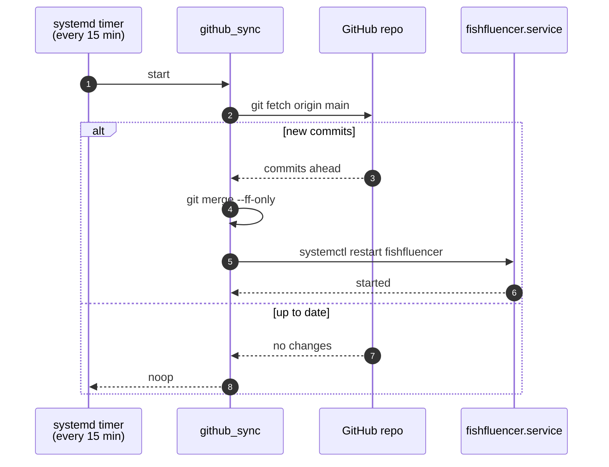
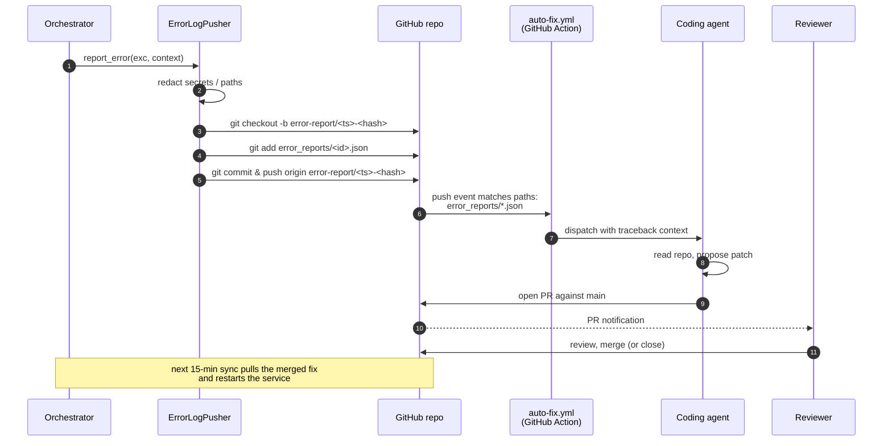

# OTA Updates & Error-Report Auto-Fix Loop

How code gets onto the device, and how errors flow back without
needing inbound SSH, a VPN, or port forwarding.

The device only ever makes **outbound** HTTPS / SSH connections.

---

## OTA pull

`fishfluencer-sync.timer` fires `fishfluencer-sync.service` every
15 minutes. That service runs the `github_sync` module, which fetches
`origin/main`, fast-forwards if there are new commits, and restarts
the main service.

Constraints:

- **Fast-forward only.** If the local branch has diverged the sync
  refuses to merge — prevents an on-device hand-edit from being
  silently overwritten.
- A failed restart triggers the error path below.

---

## Error report + auto-fix

Any uncaught exception in the orchestrator funnels through
`ErrorLogPusher`, which writes a sanitized JSON file to
`error_reports/`, commits it on a `error-report/*` branch, and pushes.
That push triggers a GitHub Action that drafts a fix PR.

Key properties:

- **Humans approve every merge.** The coding agent only opens PRs; it
  cannot self-merge.
- **No secrets leave the device.** Sanitization strips env vars,
  absolute paths, and API key fragments before the JSON is committed.
- **Closed loop.** Once a fix is merged into `main`, the next OTA
  pull (≤ 15 min later) deploys it and restarts the service. The
  device does not need any inbound access at any point.

---

## Network surface summary

| Direction | Endpoint | Purpose |
|---|---|---|
| Out | `api.anthropic.com` | Post generation (text only) |
| Out | `github.com` (SSH) | OTA pull, error report push |
| Out | `api.github.com` | Used by GitHub Actions only |
| Out | Social platform API host | Post publishing |
| **In** | **none** | No listening ports required |

If your network policy blocks one of the outbound hosts the device
will degrade gracefully: failed posts/syncs are logged and retried at
the next scheduled tick.
