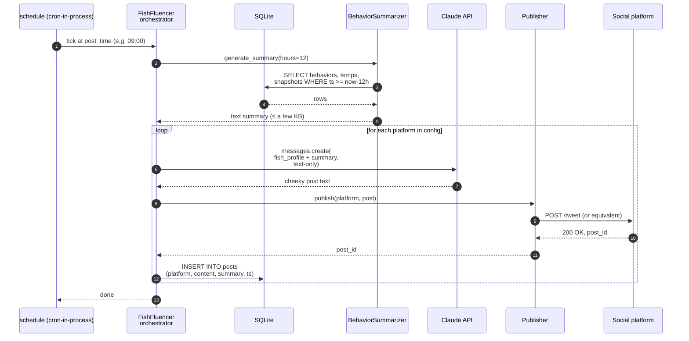
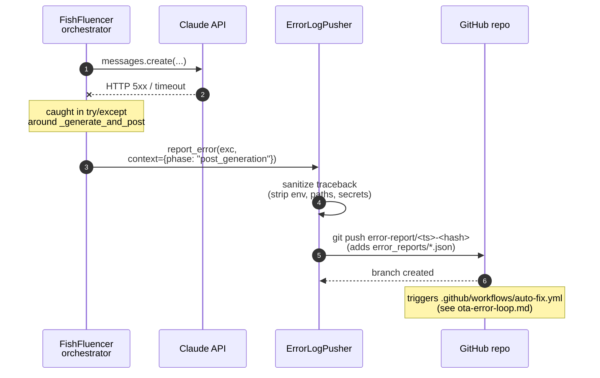

# Posting Cycle — Sequence Diagram

What happens when the scheduler fires one of the entries in
`post_times` (default `["09:00", "17:00"]`). Mirrors
`FishFluencer._generate_and_post` in `src/main.py`.

---

## Happy path

Key points:

- The Claude call payload is **text only**. No images, no base64, no
  signed URLs. The summary is generated entirely from SQLite rows.
- The fish persona (`primary_poster`) and its quirks come from
  `config/fish_profiles.yaml` — swapping the speaker is a config
  change, not code.
- Every post lands in the `posts` table along with the summary that
  produced it, so you can audit / regenerate offline.

---

## Failure path

A failed cycle does **not** crash the main loop — the orchestrator
keeps capturing frames and the next `post_time` will retry from
scratch with a fresh 12-hour summary window.
