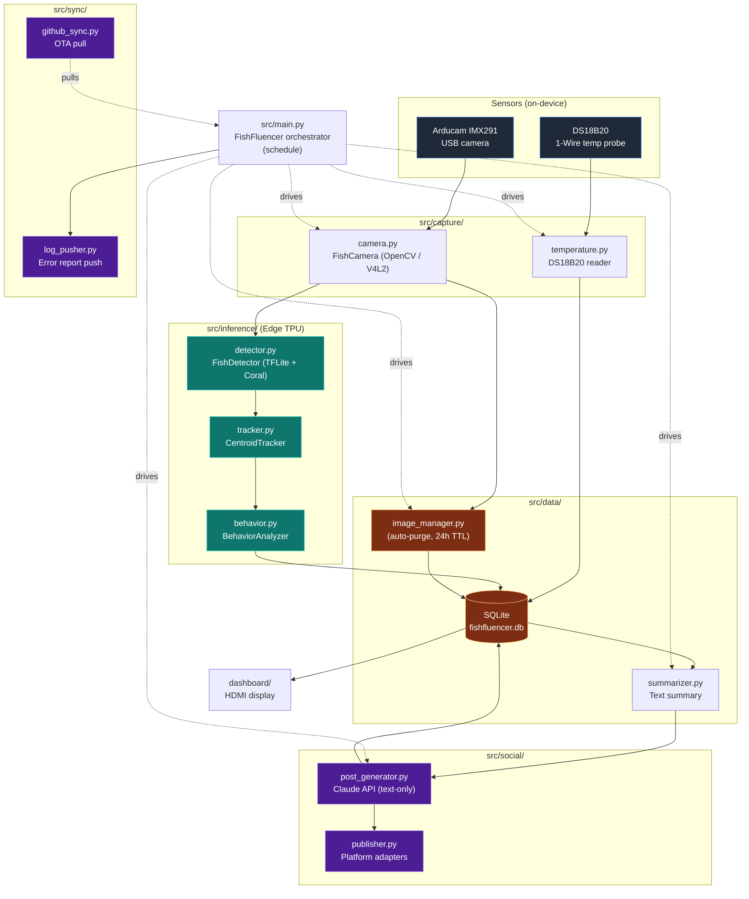
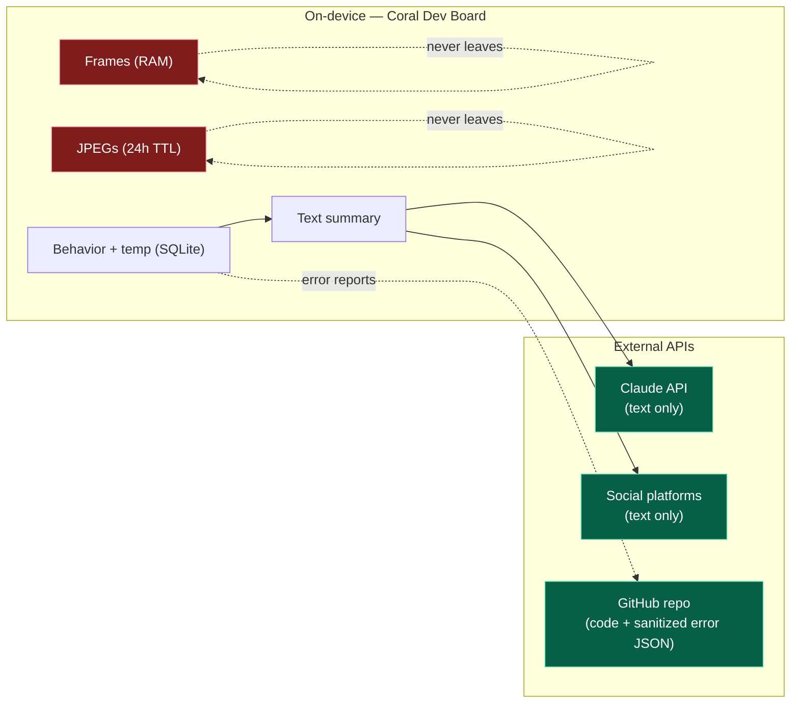

# System Architecture Diagram

Mermaid version of the block diagram in
[`ARCHITECTURE.md`](../../ARCHITECTURE.md). Useful for slides, READMEs,
and as a reference while editing module boundaries.

---

## Components

---

## Trust boundary

The fundamental privacy property is that the camera frames and JPEG
snapshots stay inside the **on-device** boundary. Only text crosses
the line.

| Data | Crosses boundary? |
|---|---|
| Raw frames / JPEGs | **No** |
| Detection bounding boxes | **No** |
| Behavior labels & temperature | Only as **text** inside a summary |
| API keys | **No** — systemd `Environment=` only |
| Error tracebacks | **Sanitized JSON** to a private repo branch |
