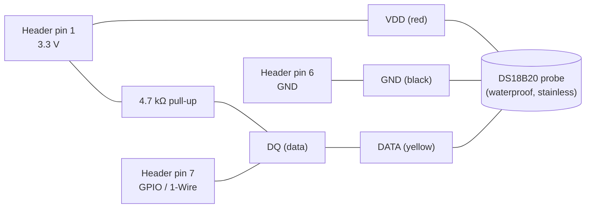

# Wiring & Pinout

All electrical connections for the FishFluencer build. Read this first
and confirm every cable is on hand before starting assembly
(`assembly.md`).

> **Verify before you wire.** Pinout references below match the **Coral
> Dev Board** (original, 40-pin header). If you have the **Coral Dev
> Board Mini**, the header is different — re-check pin numbers against
> [coral.ai/docs](https://coral.ai/docs/dev-board/datasheet/) before
> connecting the DS18B20.

---

## 1. Connection overview

```mermaid
flowchart LR
  PSU["5V / 3A USB-C PSU"] -->|USB-C power in| CORAL["Coral Dev Board<br/>(Mendel Linux + Edge TPU)"]
  CAM["Arducam IMX291<br/>USB-A male"] --> SYN["Syntech<br/>USB-C ↔ USB-A adapter"]
  SYN -->|USB-C OTG| CORAL
  DS["DS18B20<br/>1-Wire temp probe"] -->|3 wires + 4.7kΩ pull-up| HDR["40-pin GPIO header"]
  HDR --- CORAL
  CORAL -->|HDMI| HDMI_ADP["HDMI cable / adapter<br/>(see §4)"]
  HDMI_ADP --> DISP["Hamityson 7\" Mini-HDMI display"]
  DISP_PSU["Display 5V supply"] --> DISP
  SD["microSD ≥ 32 GB<br/>(Mendel image)"] --> CORAL
  ETH["Ethernet or Wi-Fi"] --> CORAL
```

---

## 2. Coral Dev Board 40-pin header (relevant pins)

The header follows the Raspberry Pi 40-pin convention. Only the pins we
use are listed; everything else stays unconnected.

| Header pin | Function | Used for |
|---:|---|---|
| 1 | 3.3 V | DS18B20 VDD **and** 4.7 kΩ pull-up reference |
| 6 | GND | DS18B20 GND |
| 7 | GPIO (1-Wire data, kernel default `w1-gpio`) | DS18B20 DQ |

> Pin 7 is the kernel default for `w1-gpio`. If you change the overlay
> to a different pin, update `config/default.yaml` (or device-tree
> overlay) accordingly.

---

## 3. DS18B20 1-Wire wiring

The DS18B20 is a 1-Wire device. **A 4.7 kΩ pull-up between DQ and 3.3 V
is mandatory** — without it the bus floats and reads return `85.0 °C`
(the sensor's power-on default) or `-127.0 °C` (CRC fail).



Wire-colour convention for the common waterproof probe:

| Probe wire | Signal | Coral header pin |
|---|---|---:|
| Red | VDD (3.3 V) | 1 |
| Black | GND | 6 |
| Yellow | DQ (data) | 7 |
| — | 4.7 kΩ resistor between Red and Yellow rails | (1 ↔ 7) |

> **Do not** wire VDD to header pin 2 or pin 4 (both 5 V). The DS18B20
> tolerates 3.0–5.5 V but the Coral GPIOs are **3.3 V** — feeding the
> data line at 5 V back into the SoC will damage it.

---

## 4. Camera path

```
Arducam IMX291 (USB-A male)
        │
        ▼
Syntech USB-C ↔ USB-A adapter
        │
        ▼
Coral Dev Board USB-C OTG port (host mode)
```

Notes:
- The Coral Dev Board's USB-C **OTG** port is separate from the USB-C
  **power** port. Power goes into the dedicated power port; the camera
  goes into the OTG port via the Syntech adapter.
- The IMX291 enumerates as a standard UVC device — `v4l2-ctl
  --list-devices` should show `/dev/video0` after boot.
- The camera draws ~150 mA at 5 V. Combined with the Coral's ~2 A, plan
  for a **5 V / 3 A** PSU minimum.

---

## 5. Display path

The Hamityson 7" is labelled "Mini HDMI" — this is **HDMI Type C**, not
Type D ("Micro"). The Coral Dev Board's video output may be full-size
HDMI Type A *or* micro HDMI depending on the revision — check yours
before ordering a cable.

| Coral output (yours) | Display input | Cable / adapter needed |
|---|---|---|
| Full-size HDMI (Type A) | Mini HDMI (Type C) | **HDMI-A male → HDMI-C male** cable |
| Micro HDMI (Type D) | Mini HDMI (Type C) | **HDMI-D male → HDMI-C male** cable (rare; use D→A + A→C adapters) |

The 7" display has its **own 5 V power input** (usually a separate
USB-A or barrel jack). Power the display from a second supply or a
USB-A port on a powered hub — **do not** try to back-feed it from the
Coral.

---

## 6. Power budget

| Load | Typical | Peak |
|---|---:|---:|
| Coral Dev Board + Edge TPU under inference | 1.2 A | 2.5 A |
| Arducam IMX291 (1080p @ 15 fps) | 0.15 A | 0.25 A |
| DS18B20 probe | < 1 mA | 1.5 mA |
| **Coral PSU (USB-C in)** | — | **5 V / 3 A** |
| Hamityson 7" display | 0.5 A | 1.0 A |
| **Display PSU (separate)** | — | **5 V / 1.5 A** |

Total wall draw: ~20 W. A single 5 V / 4 A supply with a Y-cable can
power both, but the cleaner design is two independent supplies — a
display brown-out should not reboot the inference engine.

---

## 7. Full cable / part checklist

Tick before you start `assembly.md`:

- [ ] Coral Dev Board (original, 40-pin) + heatsink fan
- [ ] microSD card ≥ 32 GB (Mendel image flashed — see `bringup.md`)
- [ ] 5 V / 3 A USB-C PSU for Coral
- [ ] Arducam IMX291 (USB-A)
- [ ] Syntech USB-C ↔ USB-A adapter
- [ ] DS18B20 waterproof probe (3-wire)
- [ ] 4.7 kΩ resistor (1/4 W is fine)
- [ ] 3 × female-to-female jumper wires (or solder direct)
- [ ] HDMI cable / adapter — confirmed against Coral revision (§4)
- [ ] Hamityson 7" Mini-HDMI display
- [ ] 5 V / 1.5 A PSU for display
- [ ] Ethernet cable **or** confirmed Wi-Fi credentials
- [ ] USB-A → USB-C data cable (for first-boot Mendel serial / `mdt`)

Optional but recommended:

- [ ] Small project enclosure (vented — Edge TPU runs warm)
- [ ] Suction-cup mount or aluminium bracket for the camera
- [ ] Cable gland or grommet where the probe enters the tank lid
